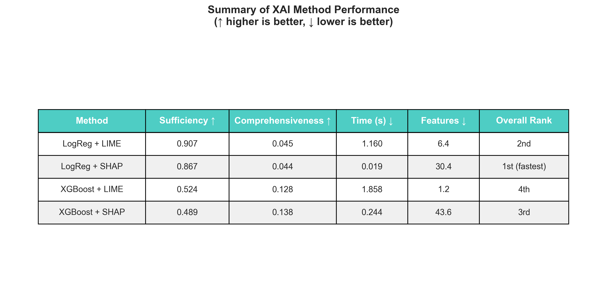
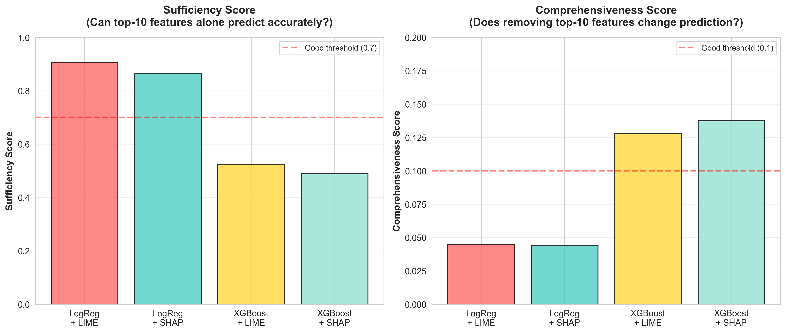
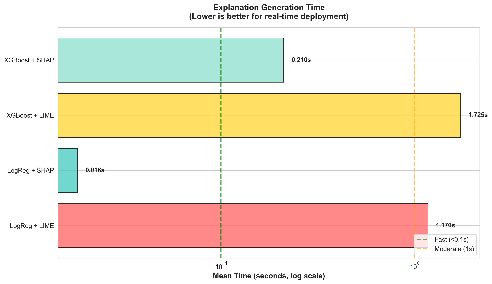
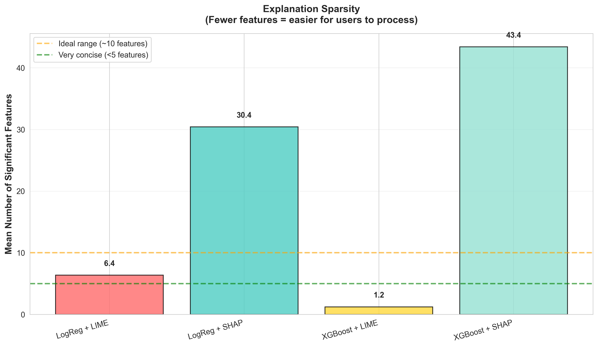
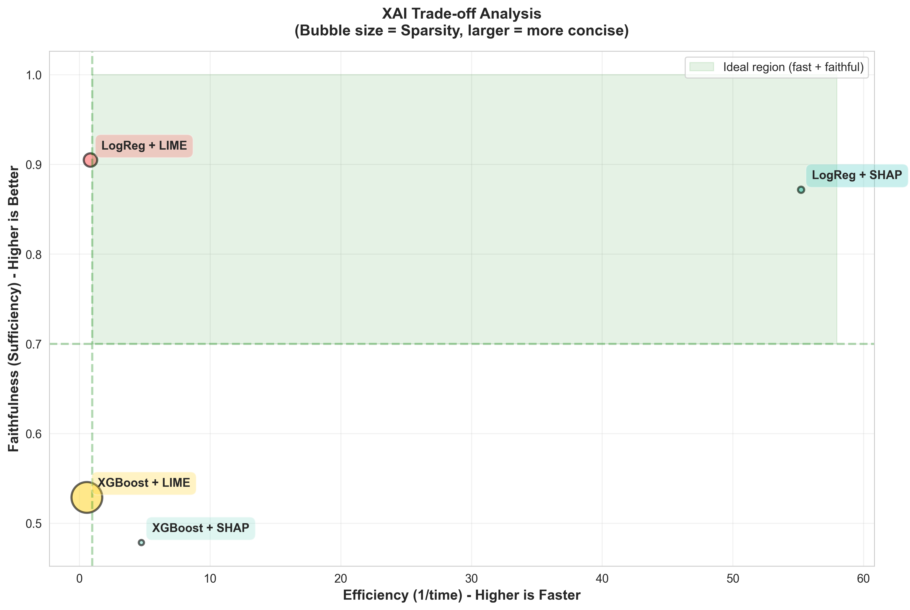

# Evaluating Explainable AI Methods for Financial Risk Classification: A Prototype Framework


## 🎯 Overview

This repository contains a research prototype for evaluating explainable AI (XAI) methods applied to **financial risk classification** from textual disclosures (SEC Item 1A risk factors). The project focuses on comparing explanation methods across **faithfulness**, **sparsity**, and **computational efficiency**, with an emphasis on regulatory and decision-making contexts. This preliminary work identifies a critical research gap and proposes a methodology for comprehensive research.

This work is intended as a research instrument, not a production system.


**Current Status:** Prototype with quantitative evaluation on 250+ documents  
**Future Direction:** Large-scale study with stakeholder validation (1,200+ documents, 20-30 practitioners)

---

## 🔬 Research Motivation
Explainable AI is widely promoted for high-stakes domains such as finance, yet there is limited empirical guidance on **which explanation methods are appropriate for which stakeholders**. In financial risk analysis, explanations must balance technical accuracy with interpretability and regulatory usability.

This project investigates how different XAI methods behave when applied to the same risk classification task, highlighting trade-offs that are often obscured in benchmark-driven evaluations.

While XAI methods are increasingly used in compliance/finance, little is known about:
- Which methods practitioners find most useful
- Whether technical metrics (faithfulness) predict user satisfaction
- How to design explanations for regulated domains

**This prototype demonstrates:**
1. ✅ Technical feasibility of comparing multiple XAI methods
2. ✅ Preliminary quantitative evaluation framework
3. ✅ Initial insights revealing significant tradeoffs between methods
4. ⏳ Foundation for comprehensive academic research

**Key Finding:** LogReg + SHAP achieves highest faithfulness and is 65x faster BUT about 4.8x less concise than LogReg + LIME. These tradeoffs matter for practitioners reviewing hundreds of documents daily—yet we lack empirical evidence on user preferences.

---

## 🚀 Proposed Academic Contributions

### Research Questions

**RQ1:** Do quantitative XAI metrics (faithfulness, efficiency, sparsity) predict which methods finance/compliance practitioners prefer and trust?

**RQ2:** What explanation properties (domain terminology, visual format, level of detail) most influence trust and decision quality?

**RQ3:** How do individual differences (expertise level, time pressure, task type) moderate explanation preferences?

**RQ4:** Can we develop evidence-based design principles for XAI in regulated domains?

### Expected Outputs

**Empirical:**
- First systematic evaluation of XAI metrics vs user preferences in finance/compliance
- Understanding of practitioner tradeoff preferences
- Evidence on domain-specific vs universal XAI properties

**Methodological:**
- Validated framework for stakeholder-centered XAI evaluation
- Standardized protocols for user studies in regulated domains

**Practical:**
- Design principles for compliance-focused explanations
- Guidance for organizations deploying XAI
- Reduced gap between XAI research and practice

---

## 📊 Prototype Dataset

- **Size:** 250+ labeled risk factor paragraphs from SEC 10-K filings
- **Task:** Multi-label classification (7 risk categories)
- **Categories:** Market, Credit, Operational, Liquidity, Legal/Regulatory, Strategic, Reputational
- **Source:** Public SEC EDGAR database (2022)
- **Labeling:** Manual annotation (keyword usage)
- **Split:** 80% train / 20% test

**Distribution:**
- Operational Risk: 22%
- Legal/Regulatory Risk: 19%
- Market Risk: 18%
- Strategic Risk: 12.5%
- Liquidity Risk: 12.5%
- Credit Risk: 9%
- Reputational Risk: 7%

**Note:** This is a proof-of-concept dataset. Full study will use 1,200+ documents with stratified sampling across industries and years.

---

## 🤖 Models Implemented

Text processing and vectorization, after which I trained the following classifiers:

| Model | Architecture | F1 (micro) | F1 (macro) | f1_samples |
|-------|-------------|-----------|-----------|----------------|
| Logistic Regression + TF-IDF | Linear (One-vs-Rest) | 0.82 | 0.80 | 0.76 | 
| XGBoost | Tree ensemble | 0.94 | 0.93 | 0.87 |

**Model Selection Rationale:**
- **LogReg**: Baseline, inherently interpretable, fast
- **XGBoost**: State-of-practice for finance/compliance, balances performance and complexity

---

## 🔍 XAI Methods Evaluated

I implemented two explanation methods under consistent experimental conditions to enable comparison:

### 1. LIME (Local Interpretable Model-agnostic Explanations)
- **Approach:** Local linear approximation via perturbed samples
- **Configuration:** 500 perturbations, top-10 features
- **Applicable to:** Both models

### 2. SHAP (SHapley Additive exPlanations)
- **Approach:** Shapley values from cooperative game theory
- **Implementation:** LinearExplainer for LogReg, TreeExplainer for XGBoost
- **Applicable to:** Both models

### Attention Weights *(Planned for FinBERT)*
- **Approach:** Extract attention scores from transformer layers
- **Status:** To be implemented with FinBERT

---

## 📈 Preliminary Results

### Quantitative Evaluation Summary



### Key Findings

#### Finding 1: Faithfulness-Efficiency Tradeoff



**Sufficiency Scores (Can top-10 features alone predict accurately?):**
- LogReg + LIME: **0.90** (highest) ✅
- LogReg + SHAP: 0.867
- XGBoost + LIME: 0.53
- XGBoost + SHAP: 0.49

**Comprehensiveness Scores (Does removing top-10 features change prediction?):**
- XGBoost + SHAP: **0.138** (highest impact) ✅
- XGBoost + LIME: 0.128
- LogReg + LIME: 0.044
- LogReg + SHAP: 0.044

**Interpretation:** LogReg + LIME shows highest sufficiency (top features alone work well). XGBoost methods show higher comprehensiveness (removing features impacts predictions more). This suggests different models produce qualitatively different explanations.

#### Finding 2: Efficiency Differences



**Mean Generation Time:**
- LogReg + SHAP: **0.018s** (fastest) ⚡
- XGBoost + SHAP: 0.24s (~12x slower)
- LogReg + LIME: 1.16s (~60x slower)
- XGBoost + LIME: 1.86s (~90x slower)

**Implication:** For a finance/compliance officer reviewing 500 documents/day:
- SHAP: ~9 seconds total
- LIME: ~9.5 minutes total

This 63x difference is operationally significant, yet faithfulness metrics don't capture this tradeoff.

#### Finding 3: Sparsity Varies Dramatically



**Mean Significant Features Highlighted:**
- XGBoost + LIME: **1.2** features (extremely sparse)
- LogReg + LIME: 6.4 features (concise)
- LogReg + SHAP: 30.4 features (dense)
- XGBoost + SHAP: 43.4 features (very dense)

**Interpretation:** SHAP highlights 5-7x more features than LIME. Research may suggest users preferring 5-10 features for manageability. SHAP's density may reduce usability despite higher faithfulness.

#### Finding 4: Multi-Metric Tradeoffs



**No single method dominates across all metrics:**
- LogReg + LIME: High sufficiency, slow, moderately sparse
- LogReg + SHAP: Good sufficiency, **very fast**, dense
- XGBoost + LIME: Lower sufficiency, slow, **extremely sparse**
- XGBoost + SHAP: Lower sufficiency, moderate speed, dense

**CRITICAL GAP:** Which tradeoff do practitioners prefer? Do they value speed over faithfulness? Is extreme sparsity (1-2 features) too little information? Current XAI research cannot answer these questions **without user studies**.

---

## 💡 Research Implications

### Why This Matters

These preliminary findings suggest **potential misalignment between technical XAI metrics and practical utility:**

1. **Faithfulness ≠ Usability:** Highest faithfulness (LIME) is 68x slower than lowest (SHAP for LogReg)
2. **Sparsity Tradeoff:** Most faithful method highlights 1-6 features; least faithful highlights 30-43 features
3. **Model-Dependent:** LogReg and XGBoost produce qualitatively different explanation patterns
4. **Operational Impact:** Speed differences of 10-100x matter at scale but aren't captured in faithfulness metrics

### Proposed Research

**Central Question:** Do quantitative XAI metrics predict which methods practitioners prefer and trust?

**Methodology:**
1. **Scale quantitative evaluation** (1,200+ documents, 6 models, 6 XAI methods)
2. **Conduct user study** with 20-30 compliance/finance professionals
3. **Analyze alignment** between technical metrics and user preferences
4. **Develop design principles** for stakeholder-centered XAI

**Expected Contributions:**
- First empirical evidence on metrics-utility alignment in finance/compliance
- Understanding of practitioner preferences across faithfulness-efficiency-sparsity tradeoffs
- Design principles for effective XAI in regulated domains
- Framework implementing evidence-based recommendations

---

## 🔧 Setup & Reproduction

### Installation
```bash
# Clone repository
git clone https://github.com/cappeadu/FinRisk-XAI
cd FinRisk-XAI

# Create virtual environment
python -m venv venv
source venv/bin/activate  # On Windows: venv\Scripts\activate

# Install dependencies
pip install -r requirements.txt
```

### Requirements
```
python>=3.10
numpy==1.26.4
pandas==2.1.4
lime==0.2.0.1
matplotlib==3.8.2
scikit-learn==1.4.0
scipy==1.11.4
seaborn==0.13.1
shap==0.49.1
spacy==3.8.11
tqdm==4.66.1
xgboost==2.0.3
ipython==8.20.0
ipywidgets==8.1.8
```

### Run Full Pipeline
```bash
# 1. Train models
python src/models/logistic_baseline.py
python src/models/xgboost_model.py

# 2. Generate explanations
python src/explainers/lime_explainer.py
python src/explainers/shap_explainer.py

# 3. Run evaluation
python -m src.evaluation.efficiency
python -m src.evaluation.sparsity
python -m src.evaluation.faithfulness
python -m src.evaluation.run_all_evaluations #runs all explanations and creates a json with metrics

# 4. Create visualizations
python visualization/create_figures.py
```

---

## 📁 Repository Structure
```
FinRisk-XAI/
│
├── README.md
├── requirements.txt
├── LICENSE
├── .gitignore
├── cik.txt
├── .dvcignore
│
├── .dvc/
│   ├── .gitignore
│   └── config
│       
├── data/
│   ├── .gitignore
│   ├── item_1a.csv.dvc
│   ├── risk_data.csv
│   ├── risk_paragraph_labeled.csv
│   └── risk_paragraph_unlabeled.csv
│
├── src/
│   ├── models/
│   │   ├── logistic_baseline.py
│   │   └── xgboost_model.py 
│   ├── explainers/
│   │   ├── __init__.py
│   │   ├── lime_explainer.py
│   │   └── shap_explainer.py
│   └── evaluation/
│       ├── __init__.py
│       ├── faithfulness.py
│       ├── efficiency.py
│       ├── sparsity.py
│       └── run_all_evaluations.py
│
├── notebooks/
│   ├── 01_get_company_cik.ipynb
│   ├── 02_eda_create_unlabeled.ipynb
│   ├── 03_data_labelling.ipynb
│   ├── 04_baseline_models.ipynb
│   ├── 05_lime_explainer.ipynb
│   └── risk_distribution.ipynb
│
├── results/
│   ├── figures/
│   │   ├── faithfulness_comparison.png
│   │   ├── efficiency_comparison.png
│   │   ├── sparsity_comparison.png
│   │   ├── tradeoff_analysis.png
│   │   └── summary_table.png
│   ├── evaluation/
│   │   └── quantitative_results.json
│   └── model_artifacts/
│       ├── logistic_baseline.pkl
│       ├── logistic_metrics.json
│       ├── xgboost.pkl
│       └── xgboost.json
│
└── visualization/
    └── create_figures.py

```
---

## ⚠️ Limitations & Future Work

### Current Limitations

1. **Small dataset (N=250+):** Proof-of-concept only; not generalizable
2. **No user validation:** Quantitative metrics only; cannot assess practitioner preferences yet
3. **Limited model diversity:** 2 models
4. **Single domain:** Financial risk/compliance only
5. **Focus on English-language financial disclosures**

These limitations are intentional and define the scope of future work.

### Planned Extensions (Academic Research)

1. **Scale dataset:** 1,200+ documents with stratified sampling across:
   - Industries (finance, tech, healthcare, energy, etc.)
   - Company sizes (small-cap, mid-cap, large-cap)
   - Years (2020-2024 for temporal patterns)

2. **User study with 20-30 finance/compliance professionals:**
   - Preference ratings (understandability, trust, actionability)
   - Decision tasks (flag true vs false positives)
   - Think-aloud protocols (qualitative insights)
   - Cognitive load measurement (NASA-TLX)

3. **Expand model coverage:**
   - Add FinBERT (transformer-based)
   - Add SVM (kernel methods)
   - Add Random Forest (ensemble)
   - Add LegalBERT (domain-specific transformer)

4. **Expand XAI methods:**
   - Integrated Gradients (gradient-based)
   - Counterfactual Explanations (example-based)
   - Anchors (rule-based)

5. **Develop XAI-Eval Framework:**
   - Automated method comparison
   - Domain-specific templates
   - User validation protocols

---

## 📚 Related Work

### Prior Research

**Educational Outcomes Prediction:**  
Appeadu, C. (2025). Harnessing Explainable AI to Inform Educational Decision-Making: A Machine Learning Study on Graduation Rates. *Preprint*. [[Zenodo URL](https://zenodo.org/records/18238053)] [[DOI](10.5281/zenodo.18238052)]

This work demonstrated XAI application in education but lacked stakeholder validation thereby motivating the current research direction.

### Key References

**XAI Methods:**
- Ribeiro et al. (2016) - "Why Should I Trust You?" (LIME)
- Lundberg & Lee (2017) - "A Unified Approach to Interpreting Model Predictions" (SHAP)

**XAI Evaluation:**
- Mohseni et al. (2021) - "A Multidisciplinary Survey and Framework for Design and Evaluation of Explainable AI Systems"
- Nauta et al. (2023) - "From Anecdotal Evidence to Quantitative Evaluation Methods: A Systematic Review on Evaluating Explainable AI"

**Financial ML:**
- Araci (2019) - "FinBERT: Financial Sentiment Analysis with Pre-trained Language Models"

---

## 📄 Citation

If you reference this prototype, please cite:
```bibtex
@misc{appeadu2026FinRisk-XAI,
  title={Evaluating Explainable AI Methods for Financial Risk Classification: A Prototype Framework},
  author={Appeadu, Clement},
  year={2026},
  note={Preliminary research prototype},
  url={https://github.com/cappeadu/FinRisk-XAI}
}
```

---

## 📧 Contact

**Clement Appeadu**  
MSc Data Science, MBA Finance 
Email: appeaduclement@gmail.com  
LinkedIn: [linkedin.com/in/clement-appeadu-9b6a2b148](http://linkedin.com/in/clement-appeadu-9b6a2b148)  
GitHub: [github.com/cappeadu](https://github.com/cappeadu)

**Note:** This is preliminary research conducted as preparation for academic studies in stakeholder-centered explainable AI. For collaboration or questions about the full research proposal, please reach out.

---

## 🙏 Acknowledgments

- SEC EDGAR database for providing open access to financial filings
- Data downloaded using script by Loukas, Lefteris and Billert, Fabian and Fergadiotis, Manos and Malakasiotis, Prodromos and Androutsopoulos, Ion [Paper link](https://dl.acm.org/doi/10.1145/3701716.3715289) [Github](https://github.com/lefterisloukas/edgar-crawler)
- Swansea University for supporting health data research experience
- Open-source XAI community (SHAP, LIME developers)

---

## 📝 License

This project is licensed under the MIT License - see [LICENSE](LICENSE) file for details.

**Data Note:** SEC 10-K filings are public domain. My labeled annotations are released under CC-BY-4.0 for research purposes.

---
